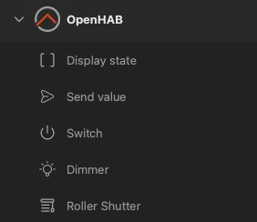
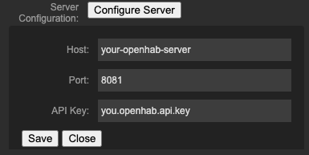

# Elgato Stream Deck openHAB plugin

StreamDeck openHAB plugin is a Javascript plugin for the Elgato StreamDeck to control your [openHAB](https://www.openhab.org) smart home.

## Supported Stream Deck devices

The plugin is build and tested on a Stream Deck+ device and supports both the keys and the dials.

The keys work the same on the other devices so I don't expect any issues there.

## Features

The plugin uses both the openHAB Rest API and the Websocket.

The Rest API is used for sending direct commands to your openHAB item. 
The Websocket is used to receive new item states from the openHAB server and updates the Stream Deck keys with the updated state.

To control your openHAB smart home, you can add the following functions to your Stream Deck:

| Function | Control | Explaination | Example |
| -- | -- | -- | -- |
| Display State | Key | Displays the current state of an item |Current temperature |
| Send value | Key | Send the configured value to an item | On/Off, Percentage, Numeric value |
| Switch | Key | Toggles a switch item | Switch ON / OFF |
| Dimmer | Key / Dial | Controls the brightness of a dimmer item | Light brightness |
| Roller shutter | Dial | Controlls the position of a roller shutter item | Roller Shutter, Blinds, Curtains |

## Installation

Download the org.openhab.stream-deck-plugin.streamDeckPlugin
 file from the [releases](https://github.com/soleetions/streamdeck-plugin-openhab/releases) page, and double-click it.

Support from the Elgato Plugin marketplace will be added soon hopefully!

## Getting started

After installing the plugin you can assign the functions to your keys or dials by choosing one of the options.

When configuring the first key (or dial) function, you need to set up the following openHAB server properties:

- server Host (host name or ip-address)
- server Port
- API key (see the [openHAB manual](https://www.openhab.org/docs/configuration/apitokens.html#openhab-api-tokens))

Next you can select the openHAB item you want to bind to the key.

## Support

If you run into any problems or have any other question, please [create an issue](https://github.com/soleetions/streamdeck-plugin-openhab/issues/new) and I'll have a look at it.

If you want to support me, feel free to [buy me a coffee](https://buymeacoffee.com/soleetions) ;-)

## License

The icons that are used a found on the [Elgato Icons page](https://github.com/elgatosf/icons) and are [MIT-licensed](https://github.com/elgatosf/icons?tab=MIT-1-ov-file)

The name openHAB and the openHAB and "works with openHAB" logo's are trademarks that are owned and protected by the [openHAB foundation](https://www.openhabfoundation.org/)
